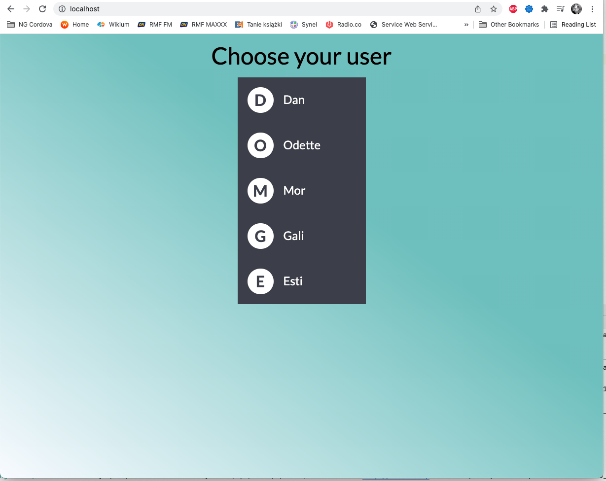
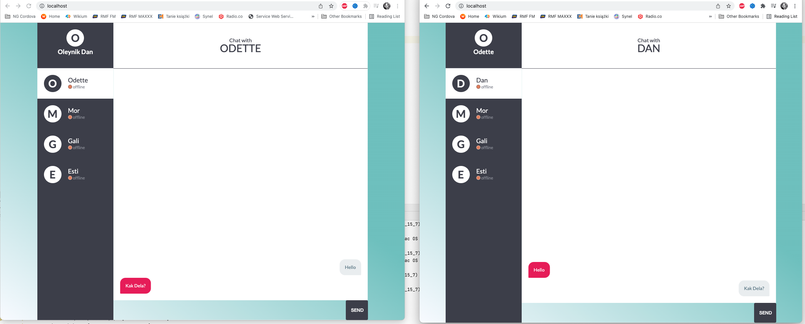

<h1 align="center">WebSocket chat</h1>

<p align="center">

</p>

---

# Installation

```bash
git clone https://github.com/dan-ados/harmonic.git
cd harmonic
sudo nano .env

POSTGRES_PASSWORD=<<YOUR_PASSWORD_HERE>>
POSTGRES_USER=<<YOUR_USER_HERE>>
POSTGRES_DB=<<YOUR_DB_NAME_HERE>>
```
Replace << >> to your variables

## Run servers
To start all dockers and server just run in command line:

```bash
docker-compose up -d
```

---

## Open your browser in new tab 
http://localhost

## Choose user you want to be


## Open again browser in new tab
http://localhost

1. Choose another user to start chatting
2. Start chatting between selected users




---
### File structure

    .
    ├── client                  # Angular application source (UI)
    ├── html                    # Angular compiled files
    ├── nginx-conf              # nginx webserver config files, used for installation
    ├── server                  # Django application source (API)
    ├── .gitignore
    ├── docker-compose.yml
    └── README.md
